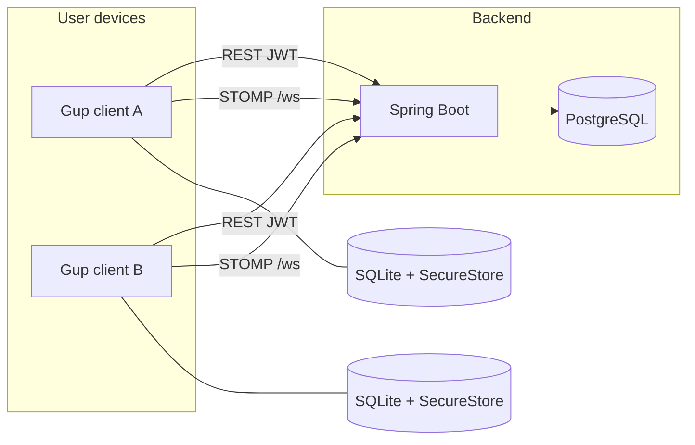
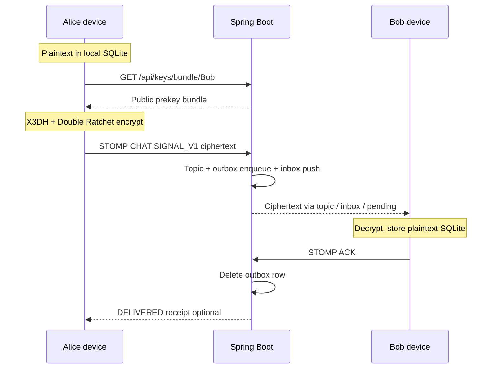
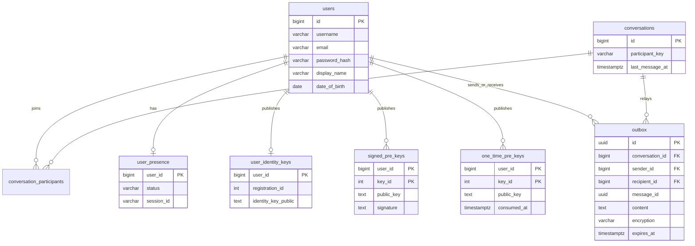

# Gup

**Gup** is a cross-platform mobile chat application with end-to-end encrypted 1:1 messaging. The client is built with Expo / React Native; the backend is Spring Boot with PostgreSQL. Message history is **local-first** (device SQLite). The server authenticates users, manages conversation metadata, and acts as a **blind store-and-forward relay** for ciphertext until delivery is acknowledged.

| | |
|---|---|
| **Client** | Expo SDK 54 · React Native · TypeScript |
| **Server** | Spring Boot 4 · Java 21 · STOMP WebSocket |
| **Data** | PostgreSQL (server) · SQLite (device) · SecureStore (keys / JWT) |
| **Crypto** | Signal Protocol (X3DH + Double Ratchet) via `@noble/*` |

---

## Table of Contents

1. [Features](#1-features)
2. [Repository layout](#2-repository-layout)
3. [System architecture](#3-system-architecture)
4. [Tech stack](#4-tech-stack)
5. [Data architecture](#5-data-architecture)
6. [Messaging & delivery](#6-messaging--delivery)
7. [End-to-end encryption](#7-end-to-end-encryption)
8. [API surface](#8-api-surface)
9. [WebSocket / STOMP contract](#9-websocket--stomp-contract)
10. [Security model](#10-security-model)
11. [Client application structure](#11-client-application-structure)
12. [Backend application structure](#12-backend-application-structure)
13. [Architecture decisions](#13-architecture-decisions)
14. [Documentation index](#14-documentation-index)
15. [Contributing](#15-contributing)
16. [License](#16-license)

---

## 1. Features

**Implemented currently**

- User registration and email/password login (JWT)
- Username search and 1:1 conversation create/list
- Real-time chat over WebSocket (STOMP)
- Local-first message history on device (SQLite)
- Store-and-forward outbox with delivery ACK
- Online / offline presence
- End-to-end encryption (Signal Protocol) for new chat bodies
- Client send queue with retry; delivery status (`SENDING` / `SENT` / `DELIVERED` / `FAILED`)

**Explicitly out of current scope**

Group chats, media attachments, push notifications, read receipts, typing indicators, multi-device sync, and cloud key backup are not part of the current product surface. See deeper design notes under [`documents/`](documents/).

---

## 2. Repository layout

```
gup/
├── backend/                 # Spring Boot API + WebSocket relay ("bakbak")
├── frontend/gup-ui/         # Expo React Native client
├── documents/               # Design docs, ADRs, E2E & migration notes
├── README.md                # This file
└── CONTRIBUTING.md          # Local development & contribution guide
```

| Path | Role |
|------|------|
| [`backend/`](backend/) | REST, STOMP, JPA, Flyway, JWT security |
| [`frontend/gup-ui/`](frontend/gup-ui/) | Mobile UI, SQLite, crypto, STOMP client |
| [`documents/`](documents/) | Canonical design and decision records |

---

## 3. System architecture

### 3.1 Context



### 3.2 Responsibilities

| Layer | Owns |
|-------|------|
| **Client** | UI, JWT/session, Signal private keys, message history, encrypt/decrypt, delivery ACK |
| **Server** | Auth, users, conversation metadata, presence, public prekey directory, opaque outbox relay |
| **PostgreSQL** | Users, conversations, participants, presence, outbox, public Signal keys |
| **Device SQLite** | Messages, local conversation cache, client send queue, ratchet sessions |

The server **does not** retain permanent chat history. After the recipient ACKs delivery, the corresponding outbox row is deleted.

### 3.3 Logical data flow (encrypted send)



---

## 4. Tech stack

### Client (`frontend/gup-ui`)

| Concern | Technology |
|---------|------------|
| Runtime | Expo SDK ~54, React Native 0.81, React 19 |
| Language | TypeScript |
| Routing | Expo Router |
| Server/cache state | TanStack Query v5 |
| Forms | react-hook-form + Zod |
| Local DB | expo-sqlite |
| Secrets | expo-secure-store |
| Real-time | Custom SockJS + STOMP client |
| E2E crypto | `@noble/curves`, `@noble/ciphers`, `@noble/hashes` |

### Backend (`backend`)

| Concern | Technology |
|---------|------------|
| Runtime | Java 21, Spring Boot 4.0.5 |
| Build | Maven |
| HTTP | Spring Web MVC |
| Real-time | Spring WebSocket + STOMP |
| Security | Spring Security, JWT (jjwt HS256), BCrypt (cost 12) |
| Persistence | Spring Data JPA / Hibernate |
| Schema | Flyway |
| Validation | Jakarta Bean Validation |

### Databases

| Store | Engine | Role |
|-------|--------|------|
| Server | PostgreSQL 16+ | Auth, metadata, outbox, public keys, presence |
| Device | SQLite (`gup.db`) | Message history, sessions, send queue |

---

## 5. Data architecture

### 5.1 PostgreSQL (server)

Flyway migrations `V1`–`V6` define the live schema. Permanent `messages` storage was removed (`V5`); chat bodies only appear transiently in `outbox`.



| Table | Purpose |
|-------|---------|
| `users` | Accounts and credentials |
| `conversations` / `conversation_participants` | 1:1 thread metadata |
| `outbox` | Temporary ciphertext (or legacy plaintext) until ACK; TTL configurable |
| `user_presence` | Online / offline for inbox push |
| `user_identity_keys` | Published Ed25519 identity public key |
| `signed_pre_keys` | Signed X25519 prekeys for X3DH |
| `one_time_pre_keys` | Consumable OTPKs for first-message handshake |

### 5.2 SQLite (device)

| Table | Purpose |
|-------|---------|
| `conversations` | Local conversation list / previews |
| `messages` | Chat history (plaintext after decrypt) |
| `outbox_pending` | Client-side send retry queue (plaintext until encrypt-at-send) |
| `signal_sessions` | Serialized Double Ratchet state per peer |
| `signal_identity_peers` | TOFU-pinned peer identity keys |

---

## 6. Messaging & delivery

### Design principles

1. **SQLite is the source of truth** for conversation messages on a device (ADR-002).
2. **ACK on persist**, not on read (ADR-003).
3. **Every recipient gets an outbox row** until ACK — including online users (ADR-007). Online also receives a push on `/user/queue/inbox`.
4. Conversation topic `/topic/conversation/{id}` is a **fast path** while that chat screen is open; it is not a substitute for the outbox.

### Delivery paths

| Path | When |
|------|------|
| `/topic/conversation/{id}` | Recipient has that chat open |
| `/user/queue/inbox` | Recipient connected and online |
| `GET /api/inbox/pending` | Bootstrap / reconnect drain |
| Server `outbox` | Durable until ACK (always written) |

### Message envelope

Shared across STOMP and local storage:

| Field | Meaning |
|-------|---------|
| `id` | Client UUID (idempotent send) |
| `conversationId`, `senderId` | Routing |
| `content` | Plaintext locally; opaque ciphertext on the wire when `encryption = SIGNAL_V1` |
| `sentAt` / `serverReceivedAt` | Timestamps |
| `type` | `CHAT` \| `ACK` \| `DELIVERED` \| `SYSTEM` |
| `encryption` | `NONE` \| `SIGNAL_V1` |

---

## 7. End-to-end encryption

New chat bodies use the **Signal Protocol** (X3DH + Double Ratchet), implemented in TypeScript with audited `@noble` primitives so the app runs in Expo Go (ADR-008).

### Algorithms

| Role | Algorithm |
|------|-----------|
| Identity & SPK signatures | Ed25519 |
| Key agreement / ratchet DH | X25519 |
| KDF | HKDF-SHA-256 |
| Chain advance | HMAC-SHA-256 |
| Message AEAD | AES-256-GCM |

### Key custody (ADR-009)

- **Private** identity / prekey material → `expo-secure-store`
- **Public** material → PostgreSQL key tables
- Ratchet state → SQLite `signal_sessions`
- No cloud key backup in the current release (reinstall = new identity)

### Wire behavior

- Control plane (ACK, DELIVERED, presence, conversation metadata) remains unencrypted at the application layer (still protected by TLS in transit).
- Chat `content` on the server is opaque `SIGNAL_V1` ciphertext.
- After decrypt, the client stores **plaintext** in SQLite for UX (same class of tradeoff as major messengers).

Client crypto lives under `frontend/gup-ui/src/crypto/` behind a facade (`signal-protocol-service.ts`). Full protocol notes: [`documents/E2E_ENCRYPTION.md`](documents/E2E_ENCRYPTION.md).

---

## 8. API surface

All routes below except auth require `Authorization: Bearer <jwt>`.

### Auth

| Method | Path | Description |
|--------|------|-------------|
| `POST` | `/api/auth/register` | Create account |
| `POST` | `/api/auth/login` | Email + password → JWT + user |

### Users

| Method | Path | Description |
|--------|------|-------------|
| `GET` | `/api/users/me` | Current profile |
| `GET` | `/api/users/search?q=&limit=` | Username prefix search |

### Conversations

| Method | Path | Description |
|--------|------|-------------|
| `POST` | `/api/conversations` | Get-or-create 1:1 thread |
| `GET` | `/api/conversations` | List threads for current user |
| `GET` | `/api/conversations/{id}/participants/presence` | Presence map |

### Inbox

| Method | Path | Description |
|--------|------|-------------|
| `GET` | `/api/inbox/pending` | Drain server outbox for current user |

### Signal keys

| Method | Path | Description |
|--------|------|-------------|
| `PUT` | `/api/keys` | Publish identity + signed prekey + OTPKs |
| `GET` | `/api/keys/bundle/{userId}` | Fetch bundle (consumes one OTPK when available) |
| `POST` | `/api/keys/signed-prekey` | Rotate signed prekey |
| `POST` | `/api/keys/onetime` | Replenish OTPKs |
| `GET` | `/api/keys/status` | Own publication / OTPK remaining count |

There is **no** REST history endpoint for messages; history is device-local.

Errors use a consistent JSON body (`timestamp`, `status`, `error`, `message`, `path`).

---

## 9. WebSocket / STOMP contract

| Item | Value |
|------|--------|
| Endpoints | `/ws` (SockJS), `/ws-native` |
| App prefix | `/app` |
| Broker prefixes | `/topic`, `/queue` |
| User prefix | `/user` |
| Auth | JWT on STOMP `CONNECT` |

### Destinations

| Direction | Destination | Purpose |
|-----------|-------------|---------|
| Client → Server | `/app/chat/{conversationId}` | Send chat (`content` + `encryption`) |
| Client → Server | `/app/ack` | Delivery ACK after SQLite persist |
| Client → Server | `/app/presence/ping` | Presence heartbeat |
| Server → Client | `/topic/conversation/{id}` | Fast path for open chat |
| Server → Client | `/user/queue/inbox` | Durable push while connected |
| Server → Client | `/user/queue/sent` | Sender echo / confirm |
| Server → Client | `/user/queue/delivery-receipts` | `DELIVERED` to sender |
| Server → Client | `/user/queue/errors` | Errors |
| Server → Client | `/topic/presence/{userId}` | Presence events |

SUBSCRIBE / SEND on conversation destinations require the user to be a participant.

---

## 10. Security model

| Concern | Mechanism |
|---------|-----------|
| Passwords | BCrypt (cost factor 12) |
| API / WebSocket identity | JWT HS256 (~7-day expiry); `sub` = user id |
| HTTP | `JwtAuthFilter` on protected routes |
| WebSocket | JWT validated on CONNECT; participant checks on SEND/SUBSCRIBE |
| Transport | TLS in production deployments |
| Message confidentiality | Signal E2EE (application layer) |
| Device secrets | SecureStore (OS Keychain / Keystore) |
| Local history | App-sandbox SQLite; plaintext after decrypt |

---

## 11. Client application structure

Layered, feature-oriented layout:

| Area | Responsibility |
|------|----------------|
| `app/` | Expo Router screens (`(auth)`, `(app)`) |
| `src/features/` | Auth, conversations, chat, search UI + hooks |
| `src/api/` | REST modules aligned with backend controllers |
| `src/websocket/` | STOMP client + message sync (encrypt/decrypt, ACK, outbox retry) |
| `src/crypto/` | Signal Protocol implementation + SecureStore key IO |
| `src/db/` | SQLite schema, migrations, repositories, bootstrap sync |
| `src/providers/` | Auth, Query, Database, ChatConnection, drafts |
| `src/types/` | Shared DTO / envelope types |

**Bootstrap order (conceptual):** providers → restore JWT → warm SQLite → publish Signal keys → connect STOMP → drain pending inbox → retry client outbox.

---

## 12. Backend application structure

Package root: `uk.deadcatlab.bakbak`

| Area | Responsibility |
|------|----------------|
| `controller/` | REST: auth, users, conversations, inbox, keys |
| `websocket/` | STOMP handlers, auth/authz interceptors, session presence |
| `service/` | Auth, users, conversations, messages (relay), outbox, presence, Signal keys |
| `model/` + `repository/` | JPA entities and queries |
| `security/` | JWT utilities and filters |
| `config/` | Security, CORS, WebSocket |
| `resources/db/migration/` | Flyway SQL |

`MessageService` treats `content` as opaque and always enqueues outbox rows for recipients; it never decrypts chat bodies.

---

## 13. Architecture decisions

Summaries of accepted ADRs (full text in [`documents/DECISIONS.md`](documents/DECISIONS.md)):

| ADR | Decision |
|-----|----------|
| ADR-001 | Single active device per account |
| ADR-002 | SQLite is message source of truth |
| ADR-003 | ACK on local persist (delivery), not on read |
| ADR-004 | Superseded — plaintext deferral ended by ADR-008 |
| ADR-005 | Conversation list refreshed via `GET /api/conversations` |
| ADR-006 | Sandbox SQLite + scoped inbox/ACK; plaintext after decrypt |
| ADR-007 | Outbox until ACK even when online |
| ADR-008 | Signal Protocol via `@noble` TypeScript |
| ADR-009 | SecureStore key custody; no cloud backup |

---

## 14. Documentation index

| Document | Contents |
|----------|----------|
| [`documents/DB_MIGRATION.md`](documents/DB_MIGRATION.md) | Local-first / outbox migration record |
| [`documents/E2E_ENCRYPTION.md`](documents/E2E_ENCRYPTION.md) | Signal Protocol implementation |
| [`documents/DECISIONS.md`](documents/DECISIONS.md) | ADR log |
| [`backend/README.md`](backend/README.md) | Backend package overview |
| [`frontend/gup-ui/README.md`](frontend/gup-ui/README.md) | Client package overview |
| [`CONTRIBUTING.md`](CONTRIBUTING.md) | How to build and run locally |

---

## 15. Contributing

Development setup, environment variables, and contribution workflow are documented in **[`CONTRIBUTING.md`](CONTRIBUTING.md)**.

---

## 16. License

See [`LICENSE`](LICENSE) in the repository root.
