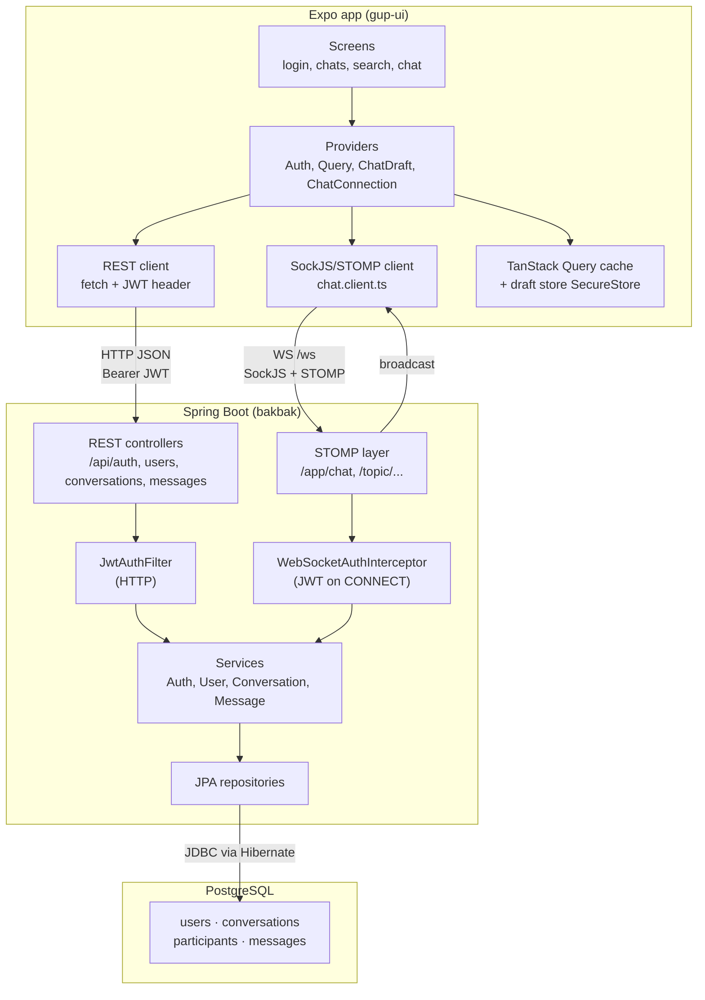

# GUP — Stack & Workflow (UI → DB)

A mental map of the major technologies and how data flows from the mobile UI to PostgreSQL.

---

## Major tech by layer

### Mobile / frontend (`frontend/gup-ui`)

| Area | Tech |
|------|------|
| Runtime | **Expo SDK 54** + **React Native 0.81** (Expo Go on device) |
| UI | **React 19**, React Native components |
| Navigation | **Expo Router** (file-based routes in `app/`) |
| Server state | **TanStack Query v5** (conversations, messages, search) |
| Forms / validation | **react-hook-form** + **zod** |
| Auth storage | **expo-secure-store** (JWT + chat drafts) |
| HTTP | `fetch` wrapper in `src/api/client.ts` |
| Real-time chat | Custom **SockJS + STOMP** client (`src/websocket/`) over WebSocket |
| Language | **TypeScript** |
| Bundler | **Metro** (via Expo CLI) |

### Backend (`backend/`)

| Area | Tech |
|------|------|
| Framework | **Spring Boot 4.0.5** (Java **21**) |
| REST API | **Spring Web MVC** |
| Real-time | **Spring WebSocket** + **STOMP** message broker |
| Security | **Spring Security** + **JWT** (jjwt, HS256, 7-day expiry) |
| Passwords | **BCrypt** |
| Persistence | **Spring Data JPA** + **Hibernate** (ORM) |
| DB driver | **PostgreSQL JDBC** |
| Schema | **Flyway** SQL migrations |
| Validation | Jakarta Bean Validation on DTOs |
| Boilerplate | **Lombok** on entities |

### Database

| Area | Tech |
|------|------|
| DB | **PostgreSQL** |
| Tables | `users`, `conversations`, `conversation_participants`, `messages` |

### Dev / ops (local)

- Backend env: `DB_URL`, `DB_USER`, `DB_PASS`, `JWT_SECRET` in `.env`
- Frontend env: `EXPO_PUBLIC_API_URL` (LAN IP for Expo Go → `:8080`)
- Tests: **JUnit**, **MockMvc**, **Testcontainers** (PostgreSQL)

---

## Mental map: UI → DB



---

## How the pieces work together

### 1. App bootstrap

```
QueryProvider → AuthProvider → ChatDraftProvider → ChatConnectionProvider → AuthGate
```

- **AuthGate** reads JWT from SecureStore; routes to `(auth)` or `(app)`.
- **ChatConnectionProvider** opens the STOMP socket when logged in.
- **TanStack Query** holds REST data (conversation list, message pages).

### 2. Login / register

```
Login screen → POST /api/auth/login (or register)
  → AuthService (BCrypt verify, JwtUtil issue token)
  → JWT returned → SecureStore
  → GET /api/users/me → user profile in AuthProvider
```

All later REST calls attach `Authorization: Bearer <jwt>` via `setTokenGetter`.

### 3. Conversation list (home)

```
index.tsx → useConversationList()
  → GET /api/conversations
  → ConversationService.listForUser()
  → JPA → PostgreSQL (only threads with messages)
  → merged with local drafts (unsent typed text) on the client
```

### 4. Search & start chat

```
search.tsx → GET /api/users/search?q=...
  → tap user → POST /api/conversations (get-or-create row + participants)
  → navigate to /chat/[conversationId]
  → draft registered locally; not in server list until first message
```

### 5. Message history (REST)

```
chat/[conversationId].tsx → useMessages()
  → GET /api/conversations/{id}/messages?limit=&before=
  → MessageService + MessageRepository (JPQL)
  → PostgreSQL messages table
```

### 6. Live send/receive (WebSocket)

```
Chat screen mounts → subscribe /topic/conversation/{id}
User sends → STOMP SEND /app/chat/{id} { content }
  → backend ChatController (@MessageMapping)
  → MessageService saves to DB
  → broadcasts to /topic/conversation/{id}
Both clients receive → merge into TanStack Query cache
```

Connection path on the client:

1. `GET /ws/info` (SockJS handshake)
2. WebSocket to SockJS URL
3. STOMP `CONNECT` with `Authorization: Bearer <jwt>`
4. `SUBSCRIBE` to topic + `/user/queue/errors`

### 7. Security model

| Channel | Auth |
|---------|------|
| REST (except `/api/auth/**`) | `JwtAuthFilter` on every request |
| WebSocket CONNECT | JWT in STOMP headers |
| SUBSCRIBE / SEND | Must be conversation participant |

Sessions are **stateless** — no server-side session store; identity lives in the JWT.

### 8. Database path (every write)

```
Controller / STOMP handler
  → Service (@Transactional)
  → JpaRepository (save / JPQL query)
  → Hibernate
  → JDBC PostgreSQL driver
  → PostgreSQL
```

Schema is owned by **Flyway** (`V1__initial_schema.sql`); Hibernate only **validates** entities match the DB (`ddl-auto=validate`).

---

## Two channels, one backend

| Concern | REST | WebSocket (STOMP) |
|---------|------|-------------------|
| Auth, register, search | ✓ | |
| List conversations | ✓ | |
| Paginated history | ✓ | |
| Send message | | ✓ (primary) |
| Receive message in real time | | ✓ |
| Update list preview | cache merge after broadcast | |

REST loads history and lists; WebSocket handles live chat. Both hit the same services and PostgreSQL.

---

## Physical deployment (local dev)

```
Phone (Expo Go)  ──WiFi──►  Mac :8080  Spring Boot
                              │
                              └── JDBC ──► PostgreSQL
Metro :8081 serves JS bundle to Expo Go (separate from API port).
```

---

## Summary

**Expo/React Native UI** → **REST + STOMP** → **Spring Boot services** → **JPA/Hibernate** → **PostgreSQL**, with **JWT** guarding both HTTP and WebSocket.
