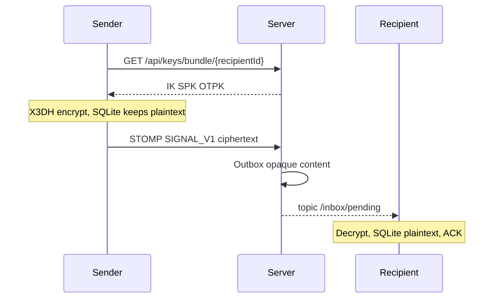

# GUP — End-to-End Encryption (Signal Protocol)

Adds **X3DH + Double Ratchet** E2EE on top of the local-first store-and-forward architecture ([DB_MIGRATION.md](./DB_MIGRATION.md)).

**Approach:** TypeScript Signal Protocol using audited `@noble/curves`, `@noble/ciphers`, and `@noble/hashes` (Expo Go compatible). Identity and prekey private material live in SecureStore; ratchet state lives in SQLite. The server is a **blind relay** — ciphertext only in the outbox.

**Single-device scope** (ADR-001). Cloud key backup is deferred (ADR-009).

---

## Legend

- `[ ]` — not started
- `[x]` — complete
- `[~]` — in progress

---

## 1. Threat model

| Threat | Mitigation |
|--------|------------|
| Honest-but-curious server | Server never sees plaintext chat bodies; outbox stores opaque `SIGNAL_V1` ciphertext |
| Network eavesdropper | Same — wire payloads are ciphertext (TLS still required for auth/metadata) |
| Device compromise | Attacker with unlocked device access can read local SQLite plaintext (Signal-like); SecureStore holds long-term secrets |
| Identity substitution | TOFU: first-seen peer identity key is pinned; mismatch fails closed |
| Reinstall / new device | New identity keys; old sessions invalid; pending outbox ciphertext for old identity may be undecryptable |

**Out of scope:** malicious server active attacks beyond TOFU (Trust on First Use) detection, sealed sender, multi-device sync, group sender keys, formal audit.

---

## 2. Protocol

### 2.1 Primitives

| Role | Algorithm |
|------|-----------|
| Identity signing | Ed25519 |
| DH / ratchet | X25519 (identity DH via Edwards→Montgomery conversion) |
| Key Derivative Function (KDF) | HKDF-SHA-256 |
| Message AEAD | AES-256-GCM |
| Signed prekey | X25519 public key, Ed25519 signature by identity |

### 2.2 X3DH (session establishment)

On first message to a peer (or after session reset):

1. Sender fetches `GET /api/keys/bundle/{recipientId}` (consumes one one-time prekey when available).
2. Sender runs X3DH with: IK_A, EK_A, IK_B, SPK_B, OPK_B (optional).
3. Shared secret seeds the Double Ratchet; first ciphertext is a **PreKey message** carrying EK_A, SPK id, OPK id, and ratchet header.

### 2.3 Double Ratchet

Per-conversation peer session:

- DH ratchet on each new remote ratchet key
- Symmetric chain ratchet per message (`N`, `PN` in header)
- Skipped message keys retained (capped) for out-of-order delivery
- Session state serialized in SQLite `signal_sessions`

### 2.4 Wire envelope

`MessageEnvelope` gains:

```ts
encryption: 'NONE' | 'SIGNAL_V1'  // default NONE when absent (legacy)
```

| `encryption` | `content` meaning |
|--------------|-------------------|
| `NONE` | Legacy plaintext (existing local history only; new sends use `SIGNAL_V1`) |
| `SIGNAL_V1` | Opaque JSON string (PreKey or ratchet message); max length raised to 16384 |

**Control plane stays plaintext:** `ACK`, `DELIVERED`, presence, conversation metadata.

**Local storage:** decrypt then persist **plaintext** in SQLite (UI never shows ciphertext).

---

## 3. Key lifecycle

1. On register/login: if no local identity → generate identity + signed prekey + ~100 OTPKs → `PUT /api/keys`.
2. Private keys: SecureStore only (iOS: Keychain, Android: Keystore / EncryptedSharedPreferences). Server stores **public** material only.
3. Foreground / connect: `GET /api/keys/status`; replenish OTPKs when low via `POST /api/keys/onetime`.
4. Reinstall: SecureStore empty → new identity published; peers detect TOFU change and must reset session.
5. Cloud backup / restore: **deferred**.

---

## 4. Server schema

### `V6__add_signal_keys.sql`

- `user_identity_keys` — `user_id`, `registration_id`, `identity_key_public`, timestamps
- `signed_pre_keys` — `user_id`, `key_id`, `public_key`, `signature`, `created_at`
- `one_time_pre_keys` — `user_id`, `key_id`, `public_key`, `consumed_at`
- `outbox.encryption` — `VARCHAR(16) NOT NULL DEFAULT 'NONE'`

---

## 5. REST API

| Method | Path | Purpose |
|--------|------|---------|
| `PUT` | `/api/keys` | Publish identity + signed prekey + OTPK batch |
| `GET` | `/api/keys/bundle/{userId}` | Prekey bundle; atomically consume one OTPK |
| `POST` | `/api/keys/signed-prekey` | Rotate signed prekey |
| `POST` | `/api/keys/onetime` | Upload more OTPKs |
| `GET` | `/api/keys/status` | Own OTPK remaining count |

---

## 6. Client modules

```
frontend/gup-ui/src/crypto/
  noble-primitives.ts
  x3dh.ts
  double-ratchet.ts
  session-cipher.ts
  signal-protocol-service.ts   # facade
  safety-number.ts
  key-storage.ts               # SecureStore
```

SQLite migration v2: `signal_sessions`, `signal_identity_peers`, `messages.encryption`.

---

## 7. Message path



---

## 8. Compatibility

- Existing SQLite rows without `encryption` → treat as `NONE`, still display.
- New CHAT sends require recipient key bundle; error if peer has not published keys.
- Presence, ACK, delivery receipts, outbox drain, client retry queue unchanged except encrypt-at-send / decrypt-at-receive.

---

## 9. Non-goals (v1)

- Official `libsignal` (future swap behind facade when leaving Expo Go)
- Encrypted cloud key backup
- Multi-device sessions
- Group E2EE
- Sealed sender
- Safety-number UI (fingerprint helper exists; UI later)

---

## 10. Test plan

- [x] Backend key publish / bundle OTPK consume
- [x] MessageService passes `encryption` through outbox and broadcasts
- [x] X3DH + Double Ratchet unit tests (in-order, skipped keys, serialize)
- [x] Manual Expo Go: two users first message + reply + offline drain
- Note: Expo Go requires `src/crypto/polyfill.ts` (`expo-crypto` → `crypto.getRandomValues`) before `@noble` keygen
